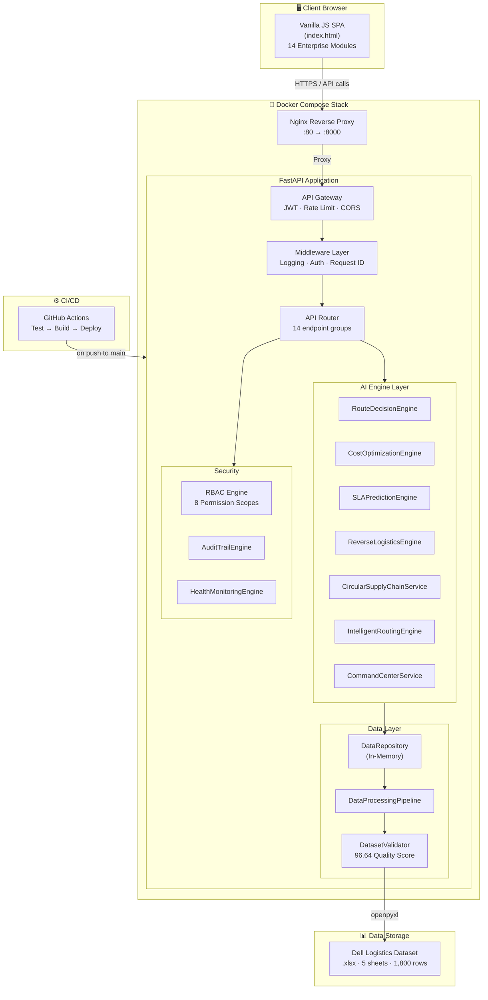
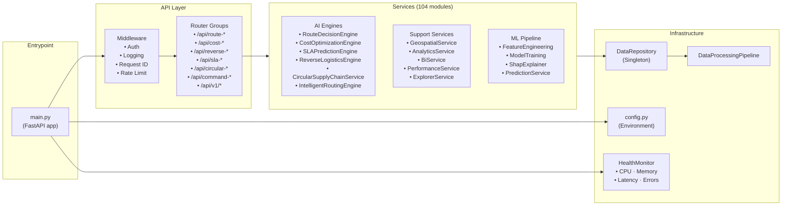
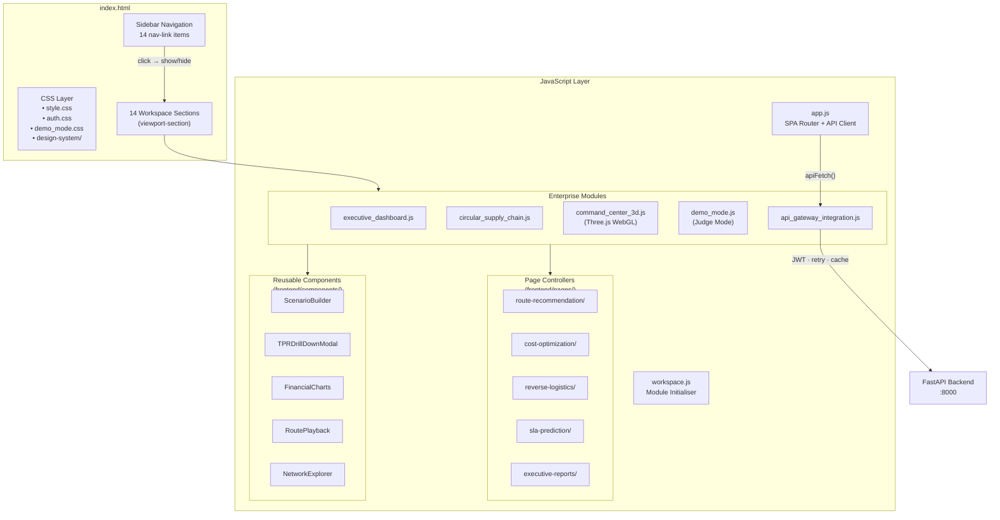
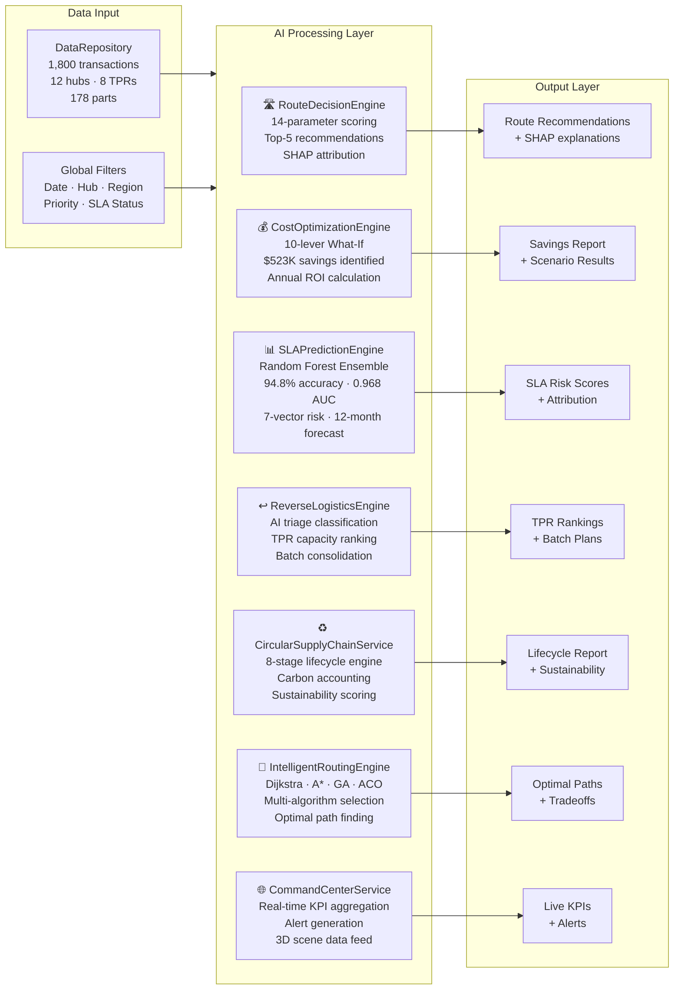
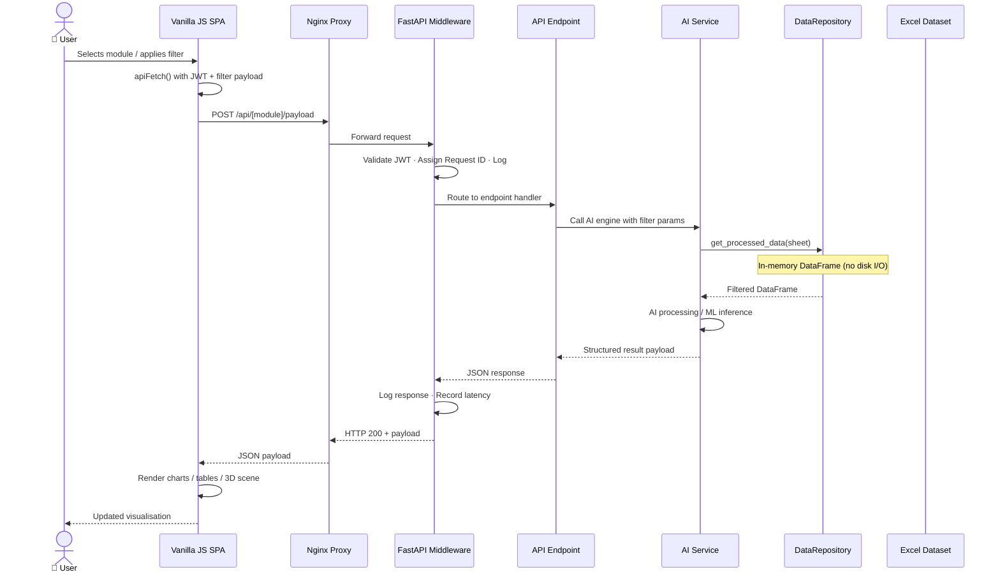
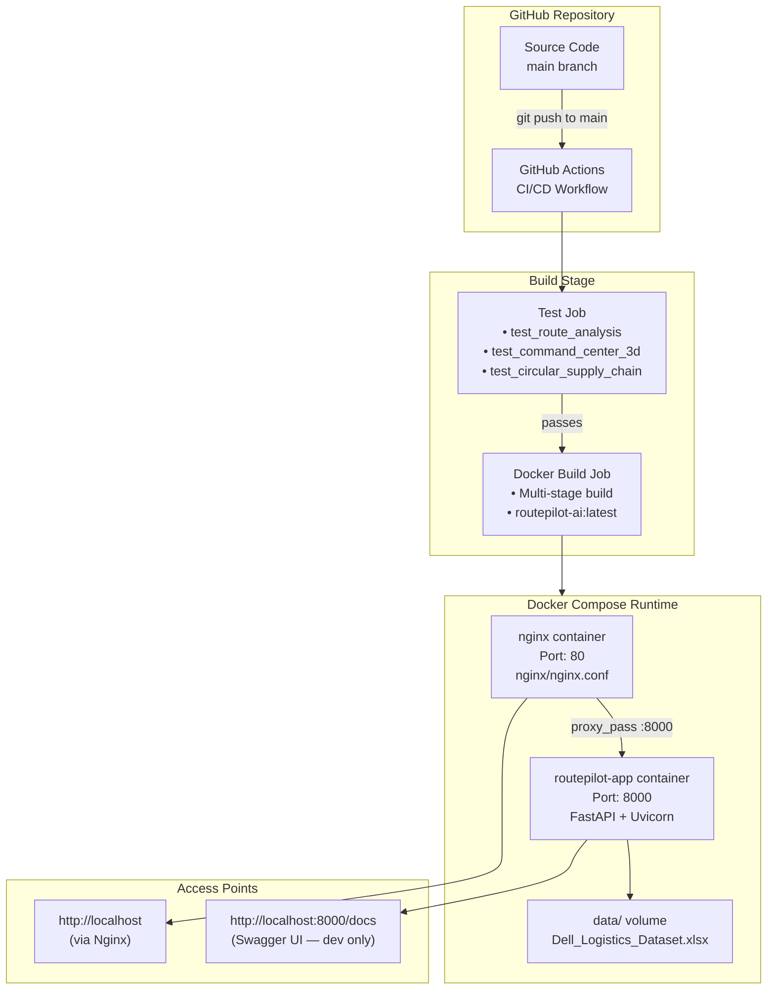

# RoutePilot AI – System Architecture

## 1. Overall System Architecture

---

## 2. Backend Architecture

---

## 3. Frontend Architecture

---

## 4. AI Engine Architecture

---

## 5. Request-Response Data Flow

---

## 6. Deployment Architecture

---

## Module Relationships

| Module | Depends On | Used By |
|:---|:---|:---|
| `DataRepository` | `DataProcessingPipeline`, `DatasetValidator` | All 104 service modules |
| `DataProcessingPipeline` | `DateProcessor`, `DuplicateProcessor`, `QualityScorer` | `DataRepository` |
| `GeospatialService` | `DataRepository` | All payload endpoints |
| `RouteDecisionEngine` | `GeospatialService`, `GraphBuilder`, `ShortestPathEngine` | `/api/route-recommendation` |
| `CostOptimizationEngine` | `DataRepository`, `CostEngine`, `CostTrends` | `/api/cost-optimization` |
| `SLAPredictionEngine` | `FeatureEngineering`, `MLModelManager`, `ShapExplainer` | `/api/sla-prediction` |
| `ReverseLogisticsEngine` | `DataRepository`, `TPRScoring`, `BatchOptimiser` | `/api/reverse-logistics` |
| `CircularSupplyChainService` | `DataRepository`, `GeospatialService` | `/api/circular-supply-chain` |
| `CommandCenterService` | `DataRepository`, `SLAPredictionEngine` | `/api/command-center`, 3D frontend |
| `IntelligentRoutingEngine` | `GraphBuilder`, `DijkstraService`, `AStarEngine`, `GeneticAlgorithmEngine`, `AntColonyEngine` | `/api/route-recommendation/recommend` |
| `AuditTrailEngine` | `DataRepository` | Security middleware |
| `HealthMonitoringEngine` | System resources | `/api/v1/monitoring/*` |
