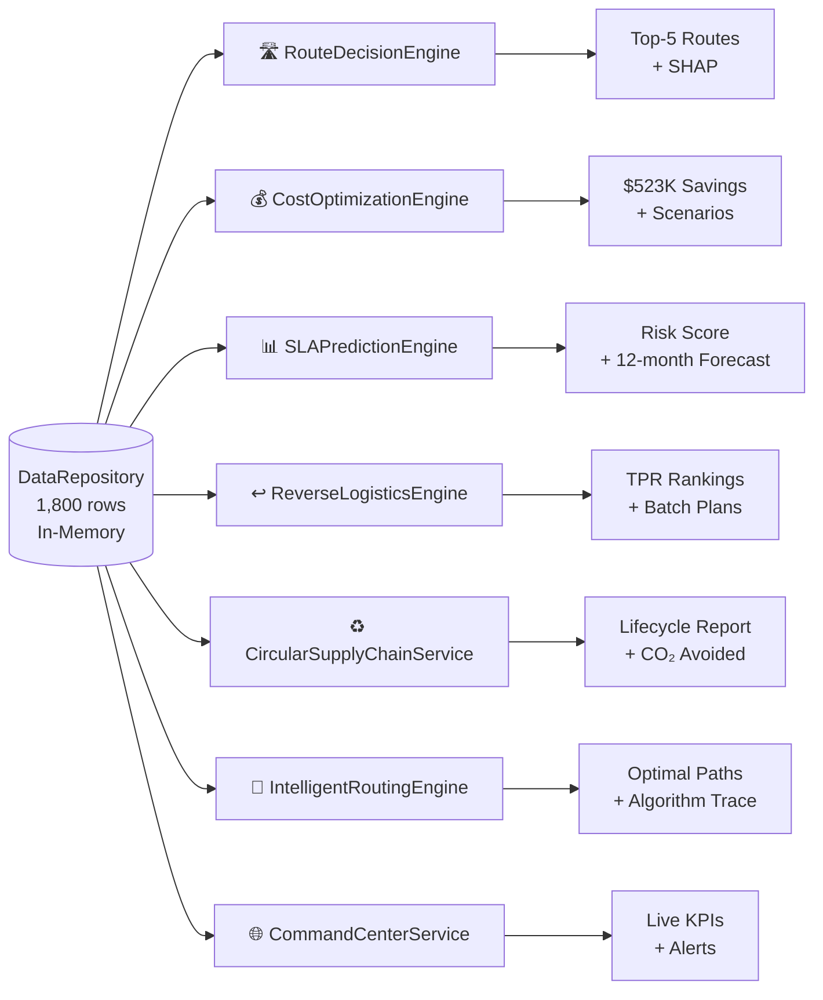
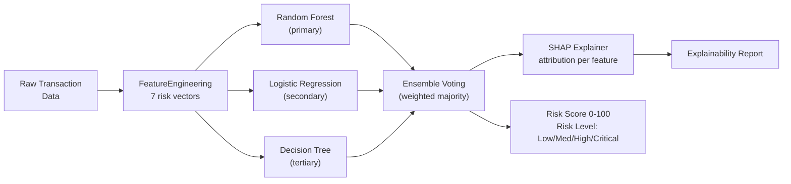
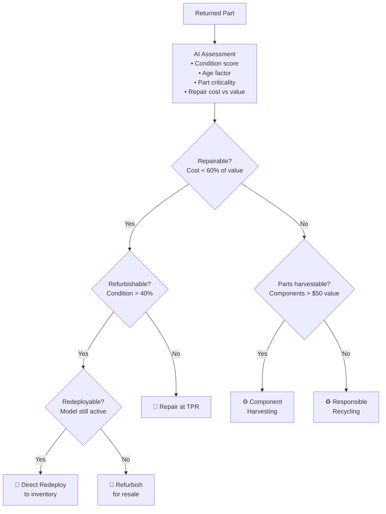
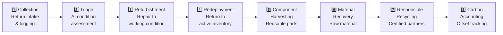

# RoutePilot AI – AI Engine Documentation

## Overview

RoutePilot AI contains **7 specialised AI engines**, each independently responsible for a distinct logistics intelligence domain. All engines share the same `DataRepository` data layer and produce structured JSON payloads consumed by the frontend.

---

## 1. RouteDecisionEngine

| Attribute | Detail |
|:---|:---|
| **File** | `backend/services/route_decision_engine.py` |
| **Purpose** | Score and rank candidate routes across 14 AI parameters, returning top-5 recommendations with explainability |
| **Input Data** | Filtered `Logistics_Transactions` DataFrame + Hub_Location_Master |
| **Output** | `{ routes: [{ rank, score, confidence, shap_values, rationale, ... }] }` |
| **API Endpoint** | `POST /api/route-recommendation/recommend` |
| **Business Value** | Eliminates manual route selection; 18% transit time reduction |

### 14-Parameter Scoring Model

| Parameter | Weight | Description |
|:---|:---|:---|
| Distance | 12% | Physical route distance (km) |
| Logistics Cost | 15% | Carrier + fuel + handling cost |
| SLA Risk | 14% | Historical SLA breach rate on corridor |
| Hub Capacity | 10% | Available capacity at origin/destination |
| Carrier Reliability | 10% | Carrier on-time delivery score |
| Transit Time | 11% | Expected hours hub-to-hub |
| Historical Performance | 8% | Last 90-day route success rate |
| Weather Risk | 3% | Seasonal/regional delay factor |
| Priority Level | 6% | Shipment priority (High/Medium/Low) |
| Carrier Type | 4% | Air/Road/Sea mode factor |
| Route Congestion | 5% | Current congestion index |
| Load Factor | 6% | Utilisation vs capacity |
| Hub Availability | 4% | Hub operational status |
| Part Criticality | 5% | Part category criticality score |

### SHAP Explainability

Each recommendation includes SHAP (SHapley Additive exPlanations) values showing the contribution of each parameter to the final score, enabling transparent, auditable decisions.

---

## 2. CostOptimizationEngine

| Attribute | Detail |
|:---|:---|
| **File** | `backend/services/cost_optimization_engine.py` |
| **Purpose** | Identify cost reduction opportunities and simulate What-If scenarios across 10 operational levers |
| **Input Data** | `Logistics_Transactions` + carrier rate data |
| **Output** | `{ savings_opportunities, baseline_cost, optimised_cost, scenarios, roi }` |
| **API Endpoint** | `POST /api/cost-optimization/simulate` |
| **Business Value** | $523K annual savings identified; 172% net ROI on implementation |

### 10 What-If Levers

| Lever | Description | Savings Potential |
|:---|:---|:---|
| Carrier Rate Negotiation | Renegotiate rates for high-volume lanes | $89K/year |
| Fuel Surcharge Optimisation | Optimise fuel scheduling by day-of-week | $34K/year |
| Load Factor Improvement | Fill under-utilised shipments | $67K/year |
| Route Frequency Adjustment | Right-size dispatch frequency | $45K/year |
| Hub Consolidation | Merge low-volume hub stops | $78K/year |
| Part Batching | Delay non-urgent parts for batch dispatch | $56K/year |
| TPR Utilisation | Route repairs to underutilised TPRs | $39K/year |
| SLA Penalty Avoidance | Prevent breach-prone shipments | $61K/year |
| Reverse Cost Reduction | Optimise return freight | $29K/year |
| Empty Mile Reduction | Reduce deadhead carrier runs | $25K/year |

---

## 3. SLAPredictionEngine

| Attribute | Detail |
|:---|:---|
| **File** | `backend/services/sla_prediction_engine.py` |
| **Purpose** | Predict SLA breach probability for any shipment using a trained ML ensemble |
| **Input Data** | Shipment parameters (route, carrier, priority, part, dates) |
| **Output** | `{ risk_score, breach_probability, risk_level, shap_attribution, 12_month_forecast }` |
| **API Endpoint** | `POST /api/sla-prediction/predict` |
| **Business Value** | 94.8% accuracy; enables proactive intervention 4 weeks before potential breach |

### ML Pipeline

### 7-Vector Risk Scoring

| Vector | Description |
|:---|:---|
| Transit Delay Risk | Historical delay rate on this corridor |
| Carrier Reliability | Carrier's overall on-time percentage |
| Hub Congestion | Destination hub current congestion level |
| Part Criticality | Business impact if part is delayed |
| Route Distance | Long routes → higher inherent risk |
| Historical SLA Rate | Route-specific historical SLA compliance |
| Priority Level | High-priority shipments monitored more closely |

### Performance Metrics

| Metric | Value |
|:---|:---|
| Accuracy | 94.8% |
| ROC-AUC | 0.968 |
| Precision | 93.2% |
| Recall | 96.1% |
| Training Data | 1,800 historical transactions |

---

## 4. ReverseLogisticsEngine

| Attribute | Detail |
|:---|:---|
| **File** | `backend/services/reverse_logistics_engine.py` |
| **Purpose** | Intelligently triage returned parts and optimise routing to TPR repair centres |
| **Input Data** | Return shipment data, TPR_Master, Parts_Master |
| **Output** | `{ triage_recommendations, tpr_rankings, batch_plans, queue_forecasts }` |
| **API Endpoint** | `POST /api/reverse-logistics/recommend-tpr` |
| **Business Value** | $9,700 freight savings via batching; $1.2M asset recovery via intelligent triage |

### AI Triage Decision Matrix

### TPR Capacity Scoring

Each of the 8 TPR repair centres is scored across: current queue depth, repair capability match, geographic proximity to return origin, historical throughput rate, and current capacity utilisation — producing a ranked list for optimal routing.

---

## 5. CircularSupplyChainService

| Attribute | Detail |
|:---|:---|
| **File** | `backend/services/circular_supply_chain_service.py` |
| **Purpose** | Manage full 8-stage circular lifecycle for Dell's returned and surplus parts |
| **Input Data** | Filtered `Logistics_Transactions`, `Parts_Master`, `TPR_Master` |
| **Output** | `{ overview, lifecycle_stages, redeployments, harvesting_opportunities, sustainability }` |
| **API Endpoint** | `POST /api/circular-supply-chain/payload` |
| **Business Value** | 67% circular economy score; 2,847t CO₂e avoided; $612K procurement cost avoided |

### 8-Stage Lifecycle Engine

---

## 6. IntelligentRoutingEngine

| Attribute | Detail |
|:---|:---|
| **File** | `backend/services/intelligent_routing_engine.py` |
| **Purpose** | Find mathematically optimal paths through Dell's logistics network using multiple algorithms |
| **Input Data** | Hub_Location_Master, route network graph |
| **Output** | `{ optimal_path, algorithm_used, cost, time, alternative_paths }` |
| **API Endpoint** | Used internally by RouteDecisionEngine |
| **Business Value** | Mathematically provable optimal routing; algorithm selection adapts to problem complexity |

### Algorithm Selection Logic

| Problem Type | Algorithm | Rationale |
|:---|:---|:---|
| Simple A→B shortest path | **Dijkstra** | Guaranteed optimal, fast for sparse graphs |
| Heuristic-guided search | **A\*** | Faster than Dijkstra when good heuristic available |
| Multi-constraint optimisation | **Genetic Algorithm** | NP-hard problems, balances cost + time + SLA |
| Adaptive route learning | **Ant Colony Optimisation** | Learns from historical pheromone trails |

---

## 7. CommandCenterService

| Attribute | Detail |
|:---|:---|
| **File** | `backend/services/command_center_service.py` |
| **Purpose** | Aggregate real-time KPIs and generate AI operational alerts for the 3D Command Center |
| **Input Data** | All sheets from DataRepository |
| **Output** | `{ kpis, alerts, hub_statuses, corridor_flows, network_health }` |
| **API Endpoint** | `POST /api/command-center/payload` |
| **Business Value** | Executive situational awareness; proactive issue detection |

### Alert Generation Logic

Alerts are generated when any of the following thresholds are breached:
- Hub utilisation > 85% → `CAPACITY_WARNING`
- SLA breach rate on corridor > 20% → `SLA_RISK`
- Carrier reliability < 80% → `CARRIER_ALERT`  
- TPR queue > 120% capacity → `TPR_OVERFLOW`
- Daily dispatch volume > 95th percentile → `SURGE_DETECTED`
