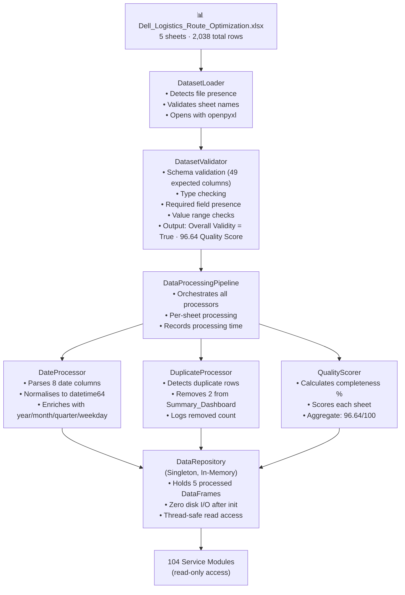
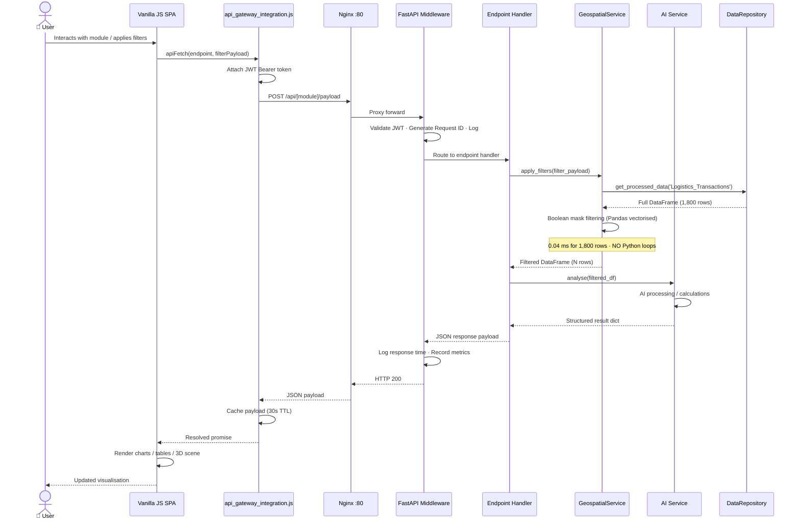
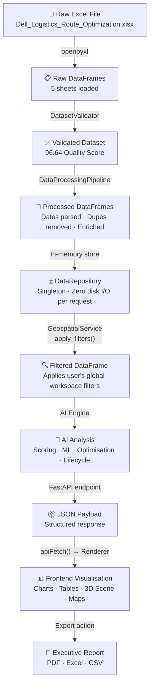
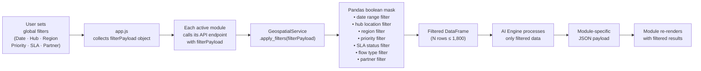
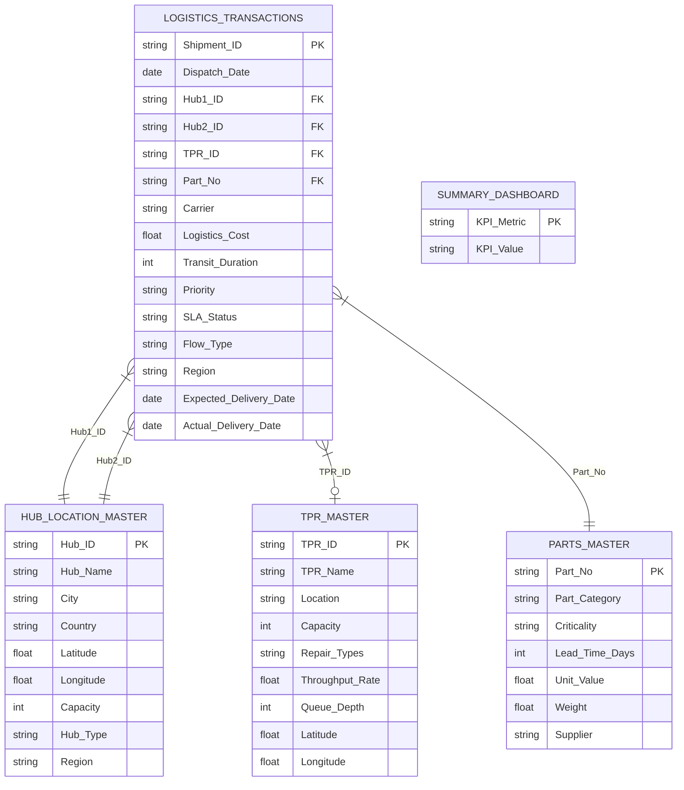

# RoutePilot AI – Data Flow Architecture

## 1. Data Sources

RoutePilot AI consumes a single Microsoft Excel workbook provided by Dell containing 5 interconnected sheets:

| Sheet | Rows | Columns | Key Fields |
|:---|:---|:---|:---|
| `Logistics_Transactions` | 1,800 | 49 | Shipment_ID, Dispatch_Date, Hub1_ID, Hub2_ID, TPR_ID, Part_No, Priority, SLA_Status, Carrier, Logistics_Cost, Transit_Duration, Actual_Delivery_Date, Expected_Delivery_Date, Flow_Type, Region |
| `Hub_Location_Master` | 12 | 11 | Hub_ID, Hub_Name, City, Country, Latitude, Longitude, Capacity, Hub_Type, Region, Contact, Status |
| `TPR_Master` | 8 | 11 | TPR_ID, TPR_Name, Location, Capacity, Repair_Types, Throughput_Rate, Queue_Depth, Status, Lat, Long, Region |
| `Parts_Master` | 178 | 11 | Part_No, Part_Category, Criticality, Lead_Time_Days, Unit_Value, Weight, Supplier, MOQ, Reorder_Point, Description, Status |
| `Summary_Dashboard` | 40 | 2 | KPI_Metric, KPI_Value (aggregated summary statistics) |

---

## 2. Data Processing Pipeline



### Processing Times (Benchmarked)

| Sheet | Processing Time | Status |
|:---|:---|:---|
| Logistics_Transactions | ~145 ms | ✅ SUCCESS |
| Hub_Location_Master | ~3 ms | ✅ SUCCESS |
| TPR_Master | ~3 ms | ✅ SUCCESS |
| Parts_Master | ~14 ms | ✅ SUCCESS |
| Summary_Dashboard | ~1 ms | ✅ SUCCESS |
| **Total** | **~165 ms** | **Quality: 96.64** |

---

## 3. API Request Data Flow



---

## 4. End-to-End Data Journey



---

## 5. Global Workspace Filter Flow

All 14 frontend modules share a single **Global Workspace Filter** bar. When filters change, every module re-queries with the new filter state.



### Filter Schema

```json
{
    "start_date":         "YYYY-MM-DD",
    "end_date":           "YYYY-MM-DD",
    "hub_location":       "HUB-DEL",
    "region":             "North India",
    "route_od":           "HUB-DEL→HUB-BLR",
    "flow_type":          "Forward",
    "logistics_partner":  "BlueDart",
    "priority":           "High",
    "sla_status":         "Breached"
}
```
All fields are optional. Omitting a field means "no filter on that dimension."

---

## 6. Data Quality Report

| Metric | Value |
|:---|:---|
| Overall Quality Score | **96.64 / 100** |
| Logistics_Transactions completeness | **98.21%** |
| Hub_Location_Master completeness | **100%** |
| TPR_Master completeness | **100%** |
| Parts_Master completeness | **100%** |
| Summary_Dashboard completeness | **85%** (after dedup) |
| Duplicate rows removed | **2** (Summary_Dashboard) |
| Date columns enriched | **8** (Logistics_Transactions) |
| Schema validation | **PASSED** |
| Overall validity | **TRUE** |

---

## 7. Database / Dataset Design

> RoutePilot AI uses Excel as its data store (as provided by Dell). The data model follows a relational structure across the 5 sheets.


