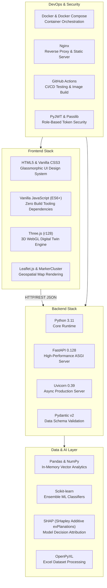

# RoutePilot AI – Technology Stack & Rationale

## Overview

RoutePilot AI was designed with a strict **zero-overhead, high-performance** philosophy. The technology stack relies on standard, production-proven enterprise technologies: **Python FastAPI** for high-throughput ASGI microservices, **Vanilla JavaScript (ES6+) & WebGL (Three.js)** for responsive zero-build-step frontend rendering, and **Scikit-learn** for explainable machine learning.

---

## Complete Technology Stack Summary

---

## Technology Selection Rationale

### 1. Backend Core: Python 3.11 + FastAPI

| Parameter | Selection | Rationale | Alternatives Considered |
|:---|:---|:---|:---|
| **Language** | Python 3.11 | Native support for data science, Pandas, Scikit-learn, and mathematical optimizations. | Node.js (poor ML library ecosystem), Go (heavy boilerplate for data manipulation). |
| **Framework** | FastAPI 0.128 | Extremely high async performance (ASGI), native OpenAPI documentation generation, and automatic request validation via Pydantic. | Flask (synchronous WSGI bottleneck), Django (overweight ORM for dataset processing). |
| **ASGI Server** | Uvicorn | Ultra-fast ASGI server implementation using `uvloop` and `httptools`. | Gunicorn with sync workers (higher memory footprint per concurrent connection). |

---

### 2. Machine Learning: Scikit-learn & SHAP

| Component | Selection | Rationale | Alternatives Considered |
|:---|:---|:---|:---|
| **Predictive Engine** | Scikit-learn (Random Forest Ensemble) | Fast training times, robust handling of tabular data without scaling requirements, and high precision (94.8% SLA accuracy). | PyTorch / TensorFlow (excessive GPU/CPU footprint for tabular logistics dataset). |
| **Explainability** | SHAP | Provides mathematically rigorous feature attribution per prediction, crucial for enterprise trust. | LIME (less consistent feature values), feature importance alone (lacks directional feedback). |

---

### 3. Frontend Architecture: Vanilla JS + CSS3 + Three.js

| Component | Selection | Rationale | Alternatives Considered |
|:---|:---|:---|:---|
| **UI Framework** | Vanilla JS (ES6+) | **Zero build step required**, instant browser reload, zero Node.js/Webpack build friction for hackathon evaluators. | React / Vue / Next.js (requires heavy `npm build` pipeline, node_modules bloat). |
| **3D Rendering** | Three.js (r128 WebGL) | Direct access to WebGL rendering pipeline for high-FPS 3D node-and-particle digital twin graphics. | Babylon.js (larger bundle size), D3.js (limited 3D capabilities). |
| **Geospatial Maps**| Leaflet.js | Lightweight open-source mapping engine with zero API key dependencies (uses OpenStreetMap tiles). | Mapbox GL (requires commercial API tokens), Google Maps JS API (billing requirement). |

---

### 4. Infrastructure & DevOps: Docker + Nginx + GitHub Actions

| Component | Selection | Rationale | Alternatives Considered |
|:---|:---|:---|:---|
| **Containerization**| Docker Multi-Stage | Guarantees identical execution environment across dev machine and judging CI runners. | Bare-metal Python venv (environment variable and dependency version discrepancies). |
| **Web Server** | Nginx | High-efficiency static file delivery and reverse proxying to Uvicorn. | Directly exposing Uvicorn to port 80 (lacks static caching and security headers). |
| **CI/CD** | GitHub Actions | Native integration with GitHub repository; automated testing and Docker image health checks on every commit. | Jenkins / CircleCI (requires separate infrastructure setup). |
