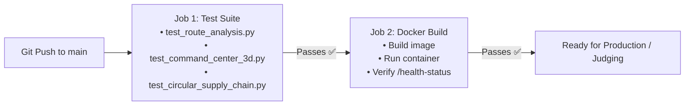

# RoutePilot AI – Deployment & Infrastructure Guide

## System Requirements

| Resource | Minimum | Recommended |
|:---|:---|:---|
| **CPU** | 2 Cores | 4 Cores |
| **RAM** | 4 GB | 8 GB |
| **Disk Space** | 2 GB free | 5 GB free |
| **OS** | macOS, Linux (Ubuntu 20.04+), Windows 10/11 (WSL2) | macOS / Linux |
| **Browser** | Chrome 90+, Edge 90+, Firefox 88+, Safari 14+ | Google Chrome |

---

## Option 1: Docker Deployment (Recommended for Judges)

The recommended way to run RoutePilot AI is using the single-command Docker Compose stack.

### Prerequisites
- Docker Engine 24.0+
- Docker Compose v2.0+

### Deployment Steps

```bash
# 1. Clone repository
git clone https://github.com/srithvik179-svg/logistics-route-optimization-ai.git
cd logistics-route-optimization-ai

# 2. Configure Environment Variables
cp .env.example .env

# 3. Build and launch container stack
docker-compose up -d --build

# 4. Verify container status
docker-compose ps
```

The application is now accessible at:
- **Web UI:** `http://localhost`
- **Backend Health Check:** `http://localhost:8000/api/v1/monitoring/health-status`

---

## Option 2: Local Development Setup (Python)

If running directly on host system without Docker:

### Prerequisites
- Python 3.11+
- Virtualenv (`python3 -m venv`)

### Setup Instructions

```bash
# 1. Create and activate virtual environment
python3 -m venv .venv
source .venv/bin/activate    # Linux/macOS
# .venv\Scripts\activate     # Windows PowerShell

# 2. Install dependencies
pip install --upgrade pip
pip install -r requirements.txt

# 3. Launch FastAPI ASGI Server
PYTHONPATH=. python -m uvicorn backend.main:app --host 0.0.0.0 --port 8000 --reload
```

Access local endpoints:
- **Web Application:** `http://localhost:8000`
- **Interactive Swagger Docs:** `http://localhost:8000/docs`

---

## Environment Configuration

The environment settings are controlled via `.env`:

```env
# Runtime Environment (production / development)
APP_ENV=production

# Server Settings
PORT=8000
LOG_LEVEL=INFO

# Security Secret (Change in production!)
SECRET_KEY=DELL_FUTUREMINDS_CHALLENGE_SECRET_2026
JWT_EXPIRE_MINUTES=60

# Data Path
DATASET_PATH=data/Dell_Logistics_Route_Optimization.xlsx

# Rate Limiting
RATE_LIMIT=100
```

---

## Automated CI/CD Workflow

The GitHub Actions workflow (`.github/workflows/ci_cd.yml`) executes automated tests and builds on every push to `main`:



---

## Troubleshooting Checklist

1. **Port 8000 in use:**
   ```bash
   lsof -i :8000
   kill -9 <PID>
   ```
2. **Missing `logs/` directory error in Docker:**
   Ensure `Dockerfile` contains `RUN mkdir -p /app/logs` prior to runtime startup.
3. **Missing `python-multipart` on file upload:**
   Ensure `python-multipart` is installed in environment (`pip install python-multipart`).
