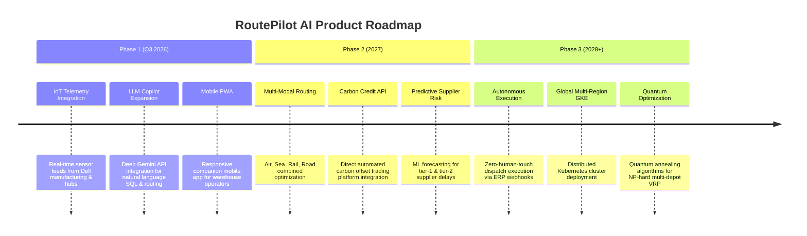

# RoutePilot AI – Future Scope & Product Roadmap

## Overview

RoutePilot AI is designed with an extensible enterprise architecture. This roadmap outlines planned technical enhancements, cloud scaling strategies, and advanced AI capabilities planned for future iterations.

---

## 🗺️ Multi-Phase Evolution Roadmap

---

## 1. Near-Term Technical Scope (Phase 1)

### Real-Time IoT Telemetry & GPS Stream Processing
- Integrate Apache Kafka streaming pipeline for real-time carrier GPS coordinates and temperature sensors.
- Enable automatic dynamic re-routing when en-route delays or thermal breaches occur.

### Advanced LLM Copilot Engine
- Upgrade AI Copilot to support multimodal RAG (Retrieval-Augmented Generation) using Gemini API.
- Support voice-command dispatch queries for warehouse managers.

---

## 2. Medium-Term Enterprise Scope (Phase 2)

### Multi-Modal Logistics Optimization
- Extend `IntelligentRoutingEngine` to compute intermodal routes combining Air Freight, Rail, and Ocean shipping.
- Incorporate customs clearance delays and port congestion indices into total transit time calculations.

### Carbon Credit & ESG Marketplace Integration
- Direct integration with verified carbon offset registries via API.
- Automated generation of Scope 3 logistics carbon compliance reports formatted for SEC/ESG disclosures.

---

## 3. Long-Term Architectural Scope (Phase 3)

### Global Multi-Region Kubernetes Deployment (GKE / EKS)
- Containerized microservice decomposition across multi-region Kubernetes clusters.
- Active-active database replication using Google Cloud Spanner or CockroachDB.

### Autonomous Reinforcement Learning Dispatcher
- Train Deep Q-Network (DQN) agents to autonomously execute daily dispatch decisions without human oversight.
