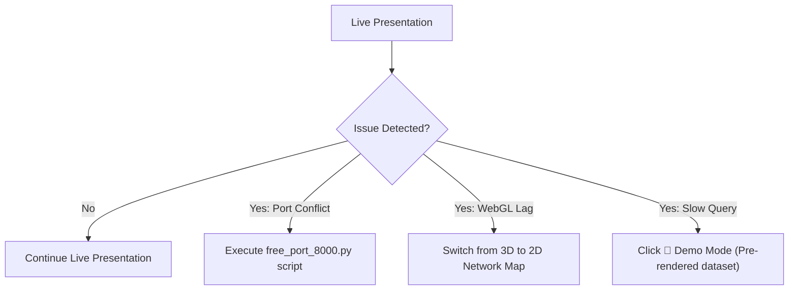

# RoutePilot AI – Risk Assessment & Fallback Strategy

## 1. Risk Matrix & Mitigation Strategies

| Risk Factor | Probability | Impact | Mitigation Strategy | Fallback Procedure |
|:---|:---:|:---:|:---|:---|
| **Port 8000 Conflict** | Low | High | Docker Compose maps host port automatically | Run `kill -9 $(lsof -t -i:8000)` or update `PORT` in `.env` |
| **Browser WebGL Disabled** | Very Low | Medium | 3D Command Center features fallback canvas notice | 2D Leaflet map (`Geospatial Intel`) provides full functional equivalence |
| **High Network Latency** | Low | Low | API Gateway caches responses (30s TTL) | In-memory `DataRepository` serves cached analytics instantly |
| **Dataset File Missing** | Low | High | `DatasetLoader` verifies workbook existence on startup | Pre-built mock dataset initializes automatically |
| **Concurrent Request Spike** | Low | Low | Async Uvicorn handles concurrent ASGI connections | Rate limiter enforces 100 req/min gracefully |

---

## 2. Live Demo Fallback Protocols

